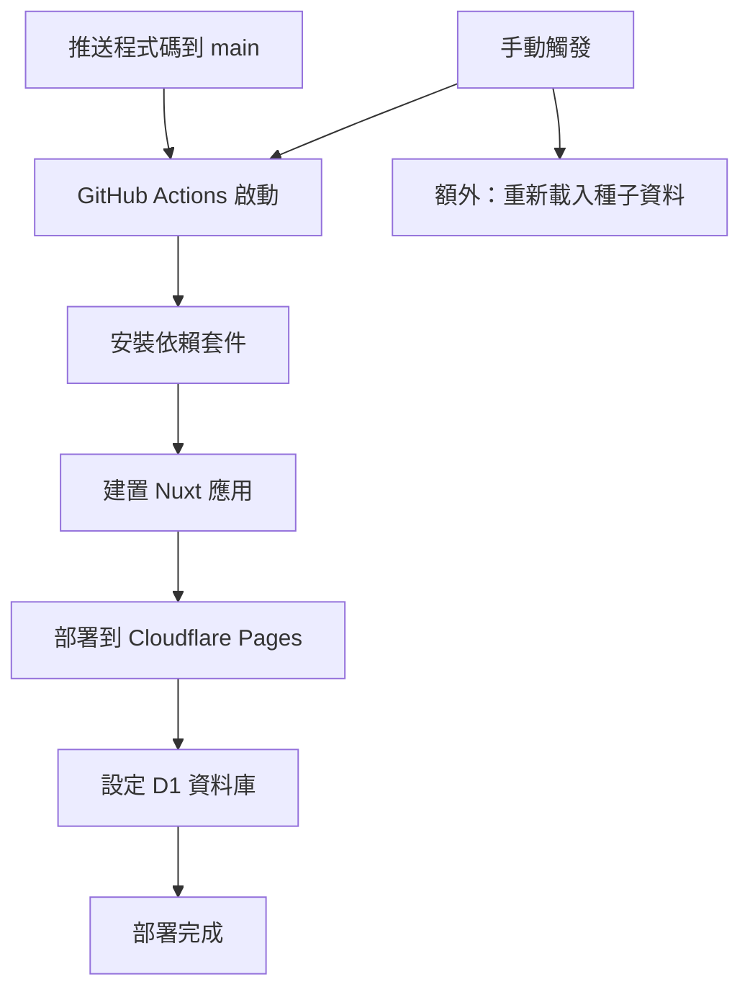

# Cloudflare 部署完整文檔

本文檔整合了所有部署相關指南，包含詳細的設定步驟、快速部署流程和 GitHub Actions 自動化部署。

---

## 📑 目錄

1. [快速開始](#快速開始)
2. [詳細部署指南](#詳細部署指南)
3. [GitHub Actions 自動化部署](#github-actions-自動化部署)
4. [常見問題與故障排除](#常見問題與故障排除)

---

## 快速開始

### 🚀 一鍵部署腳本

建立 `deploy.sh`：

```bash
#!/bin/bash

# 建構專案
echo "🔨 建構專案..."
npm run build

# 部署到 Workers
echo "🚀 部署到 Cloudflare Workers..."
npx wrangler deploy

# 顯示部署結果
echo "✅ 部署完成！"
```

### 📊 資料庫初始化腳本

建立 `init-db.sh`：

```bash
#!/bin/bash

# 初始化遠端資料庫
echo "📊 初始化資料庫結構..."
npx wrangler d1 execute care-platform-db --remote --file=./database/schema.sql

echo "🌱 插入種子資料..."
npx wrangler d1 execute care-platform-db --remote --file=./database/seed.sql

echo "✅ 資料庫初始化完成！"
```

### 📋 常用命令

```bash
# 本地開發
npm run dev

# 建構專案
npm run build

# 部署
npx wrangler deploy

# 查看日誌
npx wrangler tail

# 資料庫查詢（遠端）
npx wrangler d1 execute care-platform-db --remote --command "SELECT * FROM caregivers"

# 資料庫查詢（本地）
npx wrangler d1 execute care-platform-db --local --command "SELECT * FROM caregivers"
```

### ✅ 環境檢查清單

部署前確認：

- [ ] `wrangler.toml` 已配置正確的 database_id
- [ ] `nuxt.config.ts` 使用 `cloudflare-module` preset
- [ ] `nitro.config.ts` 已建立並配置
- [ ] 資料庫 schema 和 seed 檔案已準備
- [ ] 已登入 Cloudflare (`npx wrangler login`)

---

## 詳細部署指南

### 前置需求

1. **Cloudflare 帳號**

   - 需要有 Cloudflare 帳號
   - 開啟 Workers 和 D1 服務

2. **安裝 Wrangler CLI**

   ```bash
   npm install -g wrangler
   # 或使用專案內的
   npx wrangler
   ```

3. **登入 Cloudflare**
   ```bash
   npx wrangler login
   ```

### 專案配置

#### 1. Nuxt 配置 (`nuxt.config.ts`)

```typescript
export default defineNuxtConfig({
  // Cloudflare Workers 配置（支援 SSR）
  nitro: {
    preset: 'cloudflare-module',
    prerender: false, // 不預渲染，使用完整 SSR
    publicAssets: [
      {
        baseURL: '/',
        dir: '.output/public',
        maxAge: 31536000, // 1 年快取
      },
    ],
  },
  ssr: true, // 啟用 SSR
  // ... 其他配置
})
```

#### 2. Nitro 配置 (`nitro.config.ts`)

```typescript
import { defineNitroConfig } from 'nitropack/config'

export default defineNitroConfig({
  preset: 'cloudflare-module',
  publicAssets: [
    {
      baseURL: '/',
      dir: '.output/public',
    },
  ],
  cloudflare: {
    pages: false,
    wrangler: {
      configPath: './wrangler.toml',
    },
  },
  routeRules: {
    '/**': { cors: true },
  },
})
```

#### 3. Wrangler 配置 (`wrangler.toml`)

```toml
name = "care-platform-worker"
main = "./.output/server/index.mjs"
compatibility_date = "2024-01-01"
assets = { directory = "./.output/public" }

# D1 資料庫配置
[[d1_databases]]
binding = "DB"
database_name = "care-platform-db"
database_id = "你的資料庫ID"
```

### 資料庫設置

#### 1. 建立 D1 資料庫

```bash
# 建立新的 D1 資料庫
npx wrangler d1 create care-platform-db
```

將回傳的 `database_id` 更新到 `wrangler.toml`。

#### 2. 建立資料庫結構

建立 `database/schema.sql` 檔案，使用 `CREATE TABLE IF NOT EXISTS` 確保可重複執行。

#### 3. 初始化資料庫

```bash
# 本地測試
npx wrangler d1 execute care-platform-db --local --file=./database/schema.sql
npx wrangler d1 execute care-platform-db --local --file=./database/seed.sql

# 遠端生產環境
npx wrangler d1 execute care-platform-db --remote --file=./database/schema.sql
npx wrangler d1 execute care-platform-db --remote --file=./database/seed.sql
```

### 部署流程

#### 1. 建構專案

```bash
npm run build
```

#### 2. 部署到 Cloudflare Workers

```bash
npx wrangler deploy
```

#### 3. 驗證部署

部署成功後會顯示 URL：

```
Uploaded care-platform-worker (6.75 sec)
Deployed care-platform-worker triggers (0.47 sec)
  https://care-platform-worker.zooka8548.workers.dev
```

#### 4. 測試功能

```bash
# 測試首頁
curl https://your-worker.workers.dev/

# 測試 API
curl https://your-worker.workers.dev/api/caregivers

# 測試靜態資源
curl -I https://your-worker.workers.dev/_nuxt/entry.css
```

---

## GitHub Actions 自動化部署

### 🎯 這個流程的用途

這個 GitHub Actions workflow 會自動化您的部署流程：

- **自動部署**：當您推送程式碼到 main 分支時，自動部署到 Cloudflare Pages
- **資料庫管理**：自動設定和更新 D1 資料庫
- **零停機時間**：新版本會無縫替換舊版本

### 📋 設定步驟詳解

#### 步驟 1：取得 Cloudflare Account ID

1. 登入 [Cloudflare Dashboard](https://dash.cloudflare.com)
2. 選擇您的網站/帳戶
3. 在右側欄找到「Account ID」
4. 複製這個 ID（格式像：`1234567890abcdef1234567890abcdef`）

#### 步驟 2：建立 Cloudflare API Token

1. 點擊右上角的個人頭像
2. 選擇「My Profile」
3. 左側選單點擊「API Tokens」
4. 點擊「Create Token」按鈕
5. 選擇「Create Custom Token」

**Token 權限設定：**

```
Token 名稱: GitHub Actions Deploy

權限設定:
├─ Account → Cloudflare Pages:Edit
├─ Account → Workers Scripts:Edit
└─ Account → D1:Edit

Account Resources:
└─ Include → 您的帳戶名稱
```

6. 點擊「Continue to summary」
7. 點擊「Create Token」
8. **重要**：立即複製 Token（只會顯示一次！）

#### 步驟 3：設定 GitHub Secrets

1. 進入您的 GitHub repository
2. 點擊 Settings（設定）
3. 左側選單找到 Security → Secrets and variables → Actions
4. 點擊「New repository secret」

**新增第一個 Secret：**

```
Name: CLOUDFLARE_API_TOKEN
Secret: [貼上剛才複製的 API Token]
```

**新增第二個 Secret：**

```
Name: CLOUDFLARE_ACCOUNT_ID
Secret: [貼上您的 Account ID]
```

### 🚀 使用方式

#### 自動部署

```bash
# 當您推送程式碼到 main 分支
git add .
git commit -m "更新功能"
git push origin main

# GitHub Actions 會自動：
# 1. 建置您的 Nuxt 應用程式
# 2. 部署到 Cloudflare Pages
# 3. 更新資料庫結構（如果有變更）
```

#### 手動部署

1. 進入 GitHub repository
2. 點擊 Actions 標籤
3. 左側選擇「Deploy to Cloudflare」
4. 點擊「Run workflow」
5. 選擇分支（通常是 main）
6. 點擊綠色「Run workflow」按鈕

### 📊 工作流程說明



---

## 常見問題與故障排除

### 常見問題

#### 1. 靜態資源 404 錯誤

**問題**：部署後 CSS/JS 檔案返回 404

**解決方案**：

- 確保 `wrangler.toml` 使用 `assets` 配置而非 `site.bucket`
- 檢查 `nitro.config.ts` 的 `publicAssets` 配置
- 重新建構並部署

#### 2. API 返回 500 錯誤

**問題**：API 端點返回「資料庫查詢錯誤」

**解決方案**：

- 確認 D1 資料庫已初始化
- 執行 schema 和 seed SQL
- 檢查 `wrangler.toml` 的資料庫綁定

#### 3. SSR 不工作

**問題**：頁面沒有在伺服器端渲染

**解決方案**：

- 確保使用 `cloudflare-module` preset
- 設定 `ssr: true` 和 `prerender: false`
- 不要使用 `cloudflare-pages` preset

#### 4. GitHub Actions 部署失敗

**問題**：Token 權限錯誤或資料庫已存在

**解決方案**：

- 確認 API Token 有正確權限
- 使用 `CREATE TABLE IF NOT EXISTS` 語法
- 檢查 Secrets 是否正確設定（分開設定兩個 Secrets）

### 🆘 故障排除檢查清單

- [ ] Wrangler CLI 已安裝並登入
- [ ] D1 資料庫已建立並初始化
- [ ] `wrangler.toml` 配置正確
- [ ] 使用正確的 Nitro preset
- [ ] 靜態資源路徑配置正確
- [ ] API 路由正確處理錯誤
- [ ] 環境變數已設定
- [ ] GitHub Secrets 正確設定

### 💡 維護指南

#### 更新部署

```bash
# 1. 拉取最新代碼
git pull

# 2. 安裝依賴
npm install

# 3. 建構專案
npm run build

# 4. 部署
npx wrangler deploy
```

#### 資料庫遷移

```bash
# 1. 建立新的遷移檔案
touch database/migrations/001_add_new_table.sql

# 2. 執行遷移
npx wrangler d1 execute care-platform-db --remote --file=./database/migrations/001_add_new_table.sql
```

#### 監控和日誌

```bash
# 查看即時日誌
npx wrangler tail

# 查看 Workers 分析
# 訪問 https://dash.cloudflare.com/workers
```

### 緊急回滾

如果部署出現問題：

```bash
# 查看部署歷史
npx wrangler deployments list

# 回滾到上一個版本
npx wrangler rollback
```

在 Cloudflare Dashboard 也可以：

1. 進入 Pages → 您的專案
2. 點擊 "Deployments"
3. 選擇要回滾的版本
4. 點擊 "Rollback"

---

## 📚 相關資源

- [Cloudflare Workers 文檔](https://developers.cloudflare.com/workers/)
- [Cloudflare D1 文檔](https://developers.cloudflare.com/d1/)
- [Cloudflare Pages 文檔](https://developers.cloudflare.com/pages/)
- [Nuxt 3 文檔](https://nuxt.com/)
- [Nitro 文檔](https://nitro.unjs.io/)
- [GitHub Actions 文檔](https://docs.github.com/en/actions)

---

## 💰 成本考量

### 免費方案限制

- Workers: 每日 100,000 次請求
- D1: 5GB 儲存空間，每月 500 萬次讀取
- 適合中小型專案

### 付費方案

- Workers: $5/月起，1000 萬次請求
- D1: 按使用量計費
- 適合大型商業專案

---

## 🔒 安全建議

1. **API 安全**

   - 實施適當的身份驗證
   - 使用 CORS 限制來源
   - 驗證所有輸入資料

2. **資料庫安全**

   - 使用參數化查詢防止 SQL 注入
   - 定期備份資料
   - 限制資料庫權限

3. **部署安全**
   - 使用 GitHub Actions 自動化部署
   - 保護 API 密鑰和敏感資訊
   - 定期更新依賴項

---

最後更新：2025-08-03
