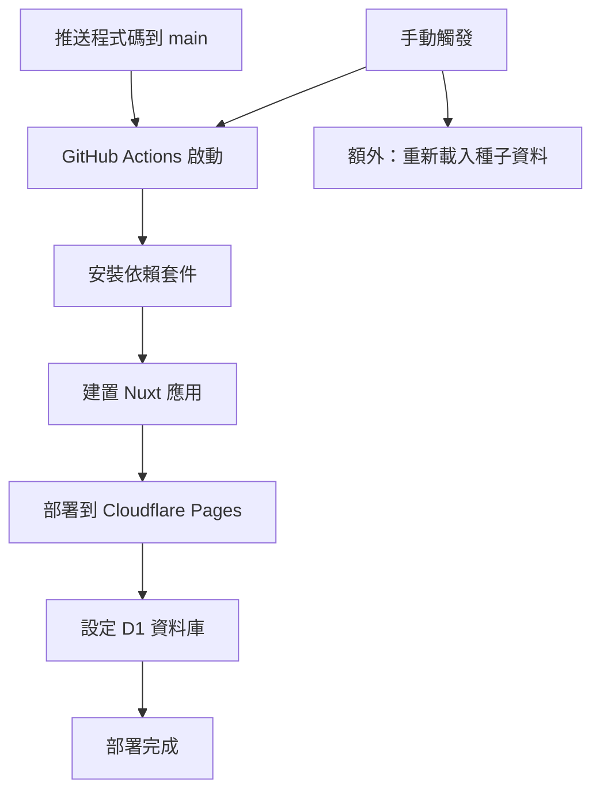

# Cloudflare 自動化部署設定指南

## 🎯 這個流程的用途

這個 GitHub Actions workflow 會自動化您的部署流程：
- **自動部署**：當您推送程式碼到 main 分支時，自動部署到 Cloudflare Pages
- **資料庫管理**：自動設定和更新 D1 資料庫
- **零停機時間**：新版本會無縫替換舊版本

## 📋 設定步驟詳解

### 步驟 1：取得 Cloudflare Account ID

1. 登入 [Cloudflare Dashboard](https://dash.cloudflare.com)
2. 選擇您的網站/帳戶
3. 在右側欄找到「Account ID」
4. 複製這個 ID（格式像：`1234567890abcdef1234567890abcdef`）

### 步驟 2：建立 Cloudflare API Token

1. 點擊右上角的個人頭像
2. 選擇「My Profile」
3. 左側選單點擊「API Tokens」
4. 點擊「Create Token」按鈕
5. 選擇「Create Custom Token」

#### Token 權限設定：
```
Token 名稱: GitHub Actions Deploy

權限設定:
├─ Account → Cloudflare Pages:Edit
├─ Account → Workers Scripts:Edit
└─ Account → D1:Edit

Account Resources:
└─ Include → 您的帳戶名稱
```

6. 點擊「Continue to summary」
7. 點擊「Create Token」
8. **重要**：立即複製 Token（只會顯示一次！）

### 步驟 3：設定 GitHub Secrets

1. 進入您的 GitHub repository
2. 點擊 Settings（設定）
3. 左側選單找到 Security → Secrets and variables → Actions
4. 點擊「New repository secret」

#### 新增第一個 Secret：
```
Name: CLOUDFLARE_API_TOKEN
Secret: [貼上剛才複製的 API Token]
```

#### 新增第二個 Secret：
```
Name: CLOUDFLARE_ACCOUNT_ID
Secret: [貼上您的 Account ID]
```

## 🚀 使用方式

### 自動部署
```bash
# 當您推送程式碼到 main 分支
git add .
git commit -m "更新功能"
git push origin main

# GitHub Actions 會自動：
# 1. 建置您的 Nuxt 應用程式
# 2. 部署到 Cloudflare Pages
# 3. 更新資料庫結構（如果有變更）
```

### 手動部署
1. 進入 GitHub repository
2. 點擊 Actions 標籤
3. 左側選擇「Deploy to Cloudflare」
4. 點擊「Run workflow」
5. 選擇分支（通常是 main）
6. 點擊綠色「Run workflow」按鈕

### 查看部署狀態
1. 在 Actions 頁面可以看到部署進度
2. 綠色勾勾 ✅ = 部署成功
3. 紅色叉叉 ❌ = 部署失敗（點擊查看錯誤）

## 📊 工作流程說明



## 🔍 重要概念解釋

### Cloudflare Pages
- **是什麼**：Cloudflare 的靜態網站託管服務
- **優點**：全球 CDN、自動 HTTPS、極快的載入速度
- **適用**：前端應用程式、靜態網站

### D1 Database
- **是什麼**：Cloudflare 的 SQLite 資料庫服務
- **優點**：邊緣運算、低延遲、自動備份
- **用途**：儲存照護人員、預約等資料

### GitHub Actions
- **是什麼**：GitHub 的自動化工作流程
- **優點**：免費額度充足、與程式碼整合
- **功能**：自動測試、部署、通知

## ⚠️ 注意事項

1. **API Token 安全**
   - 永遠不要將 Token 寫在程式碼中
   - 只透過 GitHub Secrets 使用
   - 定期更換 Token

2. **資料庫操作**
   - schema.sql 會在每次部署時執行
   - seed.sql 只在手動觸發時執行
   - 確保 SQL 語句是冪等的（可重複執行）

3. **部署時間**
   - 通常需要 2-5 分鐘
   - 首次部署可能需要更長時間
   - 可在 Cloudflare Dashboard 查看即時狀態

## 🆘 常見問題

### Q: 部署失敗怎麼辦？
1. 查看 GitHub Actions 的錯誤日誌
2. 檢查 API Token 權限是否正確
3. 確認 wrangler.toml 配置正確

### Q: 如何回滾到前一版本？
1. 在 Cloudflare Dashboard → Pages
2. 選擇您的專案
3. 點擊 "Deployments"
4. 選擇要回滾的版本
5. 點擊 "Rollback"

### Q: 可以部署到多個環境嗎？
是的！可以修改 workflow 來支援：
- `main` 分支 → 生產環境
- `develop` 分支 → 測試環境
- `feature/*` 分支 → 預覽環境

## 📚 相關資源

- [Cloudflare Pages 文檔](https://developers.cloudflare.com/pages/)
- [Cloudflare D1 文檔](https://developers.cloudflare.com/d1/)
- [GitHub Actions 文檔](https://docs.github.com/en/actions)